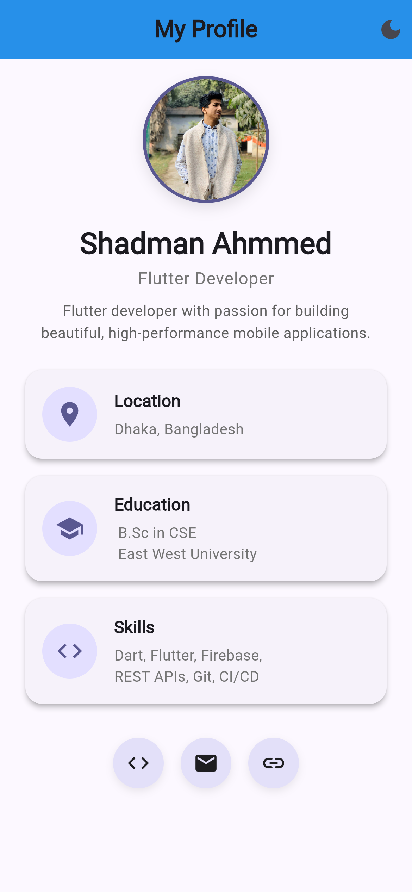
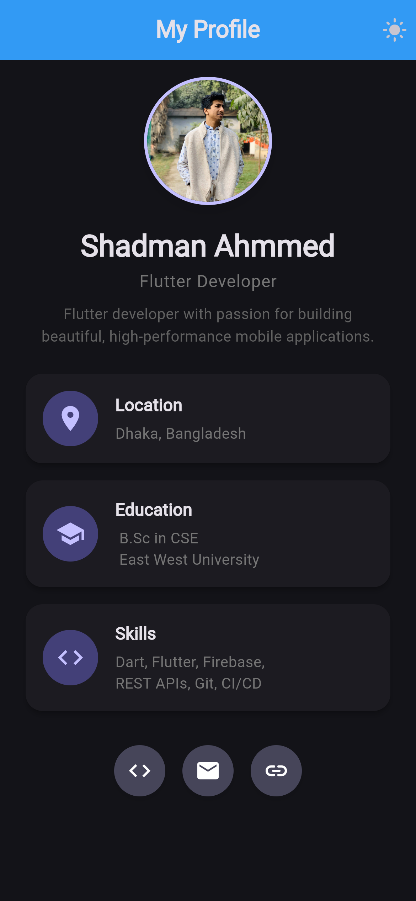

# My Profile App

A beautiful, responsive Flutter practice application showcasing personal profile information. This project features a clean UI with dark mode support and a dynamic responsive layout for both mobile and tablet devices.

## Screenshots

  
  &nbsp;&nbsp;&nbsp;&nbsp;
  

## Features
- **Responsive Layout**: Adapts layout smoothly across mobile and tablet screens.
- **Theme Support**: Seamlessly switch between Light and Dark mode.
- **Modern UI**: Built utilizing the latest Material 3 design guidelines.
